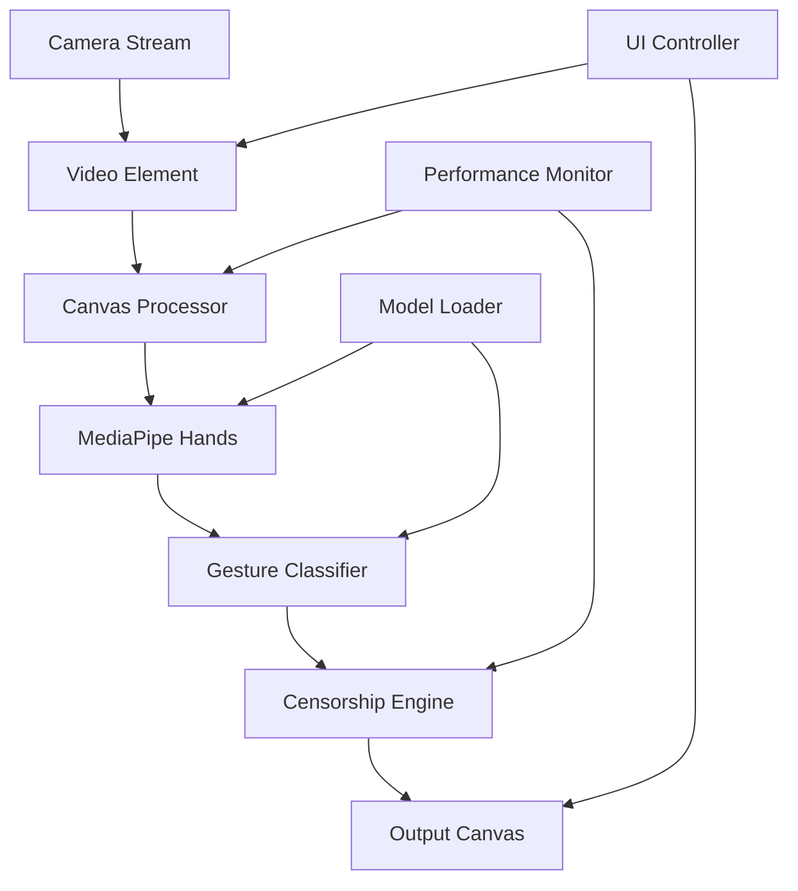

# Design Document

## Overview

Finger Ban es una aplicación web que utiliza MediaPipe Hands y TensorFlow.js para detectar gestos ofensivos en tiempo real y aplicar censura visual mediante efectos de pixelado. La arquitectura está diseñada para ejecutarse completamente en el navegador, garantizando privacidad y baja latencia.

El sistema procesa frames de video de la cámara web, detecta landmarks de manos usando MediaPipe, clasifica gestos usando lógica de detección de patrones, y aplica efectos de censura usando Canvas API y WebGL para mantener rendimiento en tiempo real.

## Architecture



### Core Components

1. **Camera Manager** - Maneja acceso a cámara web y stream de video
2. **Frame Processor** - Procesa frames individuales del video stream
3. **Hand Detection Engine** - Utiliza MediaPipe para detectar manos y landmarks
4. **Gesture Classifier** - Analiza landmarks para identificar gestos ofensivos
5. **Censorship Engine** - Aplica efectos de pixelado sobre regiones detectadas
6. **Performance Monitor** - Monitorea FPS y ajusta calidad dinámicamente
7. **UI Controller** - Maneja interfaz de usuario y controles

## Components and Interfaces

### Camera Manager
```javascript
interface CameraManager {
  initialize(): Promise<MediaStream>
  getVideoElement(): HTMLVideoElement
  stop(): void
  isActive(): boolean
}
```

### Hand Detection Engine
```javascript
interface HandDetectionEngine {
  initialize(): Promise<void>
  detectHands(imageData: ImageData): Promise<HandLandmarks[]>
  dispose(): void
}

interface HandLandmarks {
  landmarks: Point3D[]
  handedness: 'Left' | 'Right'
  confidence: number
}
```

### Gesture Classifier
```javascript
interface GestureClassifier {
  classifyGesture(landmarks: HandLandmarks): GestureResult
  updateThreshold(threshold: number): void
}

interface GestureResult {
  gesture: 'middle_finger' | 'none'
  confidence: number
  boundingBox: BoundingBox
}
```

### Censorship Engine
```javascript
interface CensorshipEngine {
  initialize(canvas: HTMLCanvasElement): void
  applyCensorship(imageData: ImageData, regions: BoundingBox[]): ImageData
  setPixelationLevel(level: number): void
}
```

## Data Models

### Point3D
```javascript
interface Point3D {
  x: number  // Normalized [0-1]
  y: number  // Normalized [0-1]
  z: number  // Depth information
}
```

### BoundingBox
```javascript
interface BoundingBox {
  x: number      // Top-left X coordinate
  y: number      // Top-left Y coordinate
  width: number  // Box width
  height: number // Box height
  confidence: number // Detection confidence [0-1]
}
```

### ProcessingConfig
```javascript
interface ProcessingConfig {
  targetFPS: number
  detectionThreshold: number
  pixelationLevel: number
  marginPercentage: number
  maxProcessingTime: number
}
```

## Error Handling

### Camera Access Errors
- **NotAllowedError**: Usuario deniega permisos de cámara
  - Mostrar mensaje explicativo y botón para reintentar
  - Ofrecer instrucciones para habilitar permisos

- **NotFoundError**: No se encuentra cámara disponible
  - Mostrar mensaje de error específico
  - Sugerir verificar conexión de cámara

### Model Loading Errors
- **NetworkError**: Falla al cargar modelos de ML
  - Implementar retry automático con backoff exponencial
  - Mostrar indicador de progreso de carga
  - Fallback a modo degradado si es posible

### Performance Issues
- **Low FPS Detection**: Rendimiento por debajo del umbral
  - Reducir automáticamente resolución de procesamiento
  - Ajustar frecuencia de detección
  - Mostrar advertencia al usuario

### Processing Errors
- **WebGL Context Loss**: Pérdida de contexto WebGL
  - Reinicializar contexto automáticamente
  - Fallback a Canvas 2D si WebGL no está disponible

## Testing Strategy

### Unit Testing
- **Gesture Classification Logic**
  - Test con datasets de landmarks conocidos
  - Verificar precisión de detección de gestos
  - Test de casos edge con manos parcialmente visibles

- **Bounding Box Calculations**
  - Verificar cálculos de coordenadas
  - Test de márgenes de seguridad
  - Validar transformaciones de coordenadas

### Integration Testing
- **Camera Integration**
  - Test de inicialización de cámara
  - Verificar manejo de diferentes resoluciones
  - Test de cleanup de recursos

- **Real-time Processing Pipeline**
  - Test de flujo completo frame-to-frame
  - Verificar sincronización entre componentes
  - Medir latencia end-to-end

### Performance Testing
- **Frame Rate Benchmarks**
  - Test en diferentes dispositivos y navegadores
  - Medir impacto de diferentes niveles de pixelado
  - Verificar degradación graceful bajo carga

- **Memory Usage**
  - Monitor de memory leaks durante uso prolongado
  - Test de cleanup de recursos WebGL
  - Verificar liberación de ImageData objects

### Visual Testing
- **Censorship Effectiveness**
  - Verificar cobertura completa de gestos detectados
  - Test de seguimiento de movimiento
  - Validar calidad visual del pixelado

- **UI Responsiveness**
  - Test de controles de interfaz
  - Verificar indicadores de estado
  - Test de responsive design en diferentes pantallas